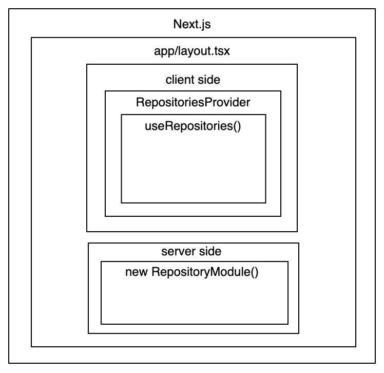

# Repository Pattern for Next.js Pages Router



## Directory Structure

### 📁 - `configs`

This directory contains global configuration files used across the application. Its main purpose is to centralize the setup of external libraries, environment-based settings, or system-wide options, making the codebase easier to maintain, test, and extend.

#### Current Stucture

```bash
src/
└── configs/
    └── api.ts        ← Axios instance configuration for HTTP client
```

#### 📄 - File `api.ts`

This file exports a pre-configured Axios instance used for all HTTP requests to backend APIs. By using this shared instance, any part of the application such as repositories or services. Example usage:

```ts
import apiInstance from '@/configs/api';

...

example: new ExampleRepository(apiInstance)
```

### 📁 - `contexts`

This directory contains **React Contexts** used to manage global or shared state across components. It follows a modular structure where each context (e.g., `RepositoryContext`) is encapsulated in its own subfolder for better organization and scalability.

#### Current Structure

```bash
src/
└── contexts/
    └── RepositoryContext/
        └── index.tsx   ← Main context provider + consumer + hook 
    └── index.ts        ← Entry point folder 
```

Example usage (`app/providers.tsx`):

```ts
"use client";

import { RepositoryProvider } from "@/contexts";
import React from "react";

interface ProvidersProps {
  children: React.ReactNode;
}

const Providers: React.FC<ProvidersProps> = ({ children }) => {
  return <RepositoryProvider>{children}</RepositoryProvider>;
};

export default Providers;
```

Example consume (**client side only**):

```ts
const api = useRepositories()

useEffect(() => {
    const getData = async () => {
        const res = await api.example.getAll()
    }
}, [])
```

### 📁 - `repositories`

This directory contains all Repository Pattern implementations, abstracting data access logic away from components and services. Repositories act as a bridge between your application’s business logic and external data sources (like REST APIs or databases).

#### Structure

```bash
src/
└── repositories/
    └── modules/
        └── post.ts      ← Repository for Post-related operations
    └── factory.ts       ← Factory function to create repository instances
```

Each file inside `modules/` represents a domain-specific repository like post.ts handles all CRUD operations related to posts. These repositories are typically instantiated via a factory (factory.ts).
